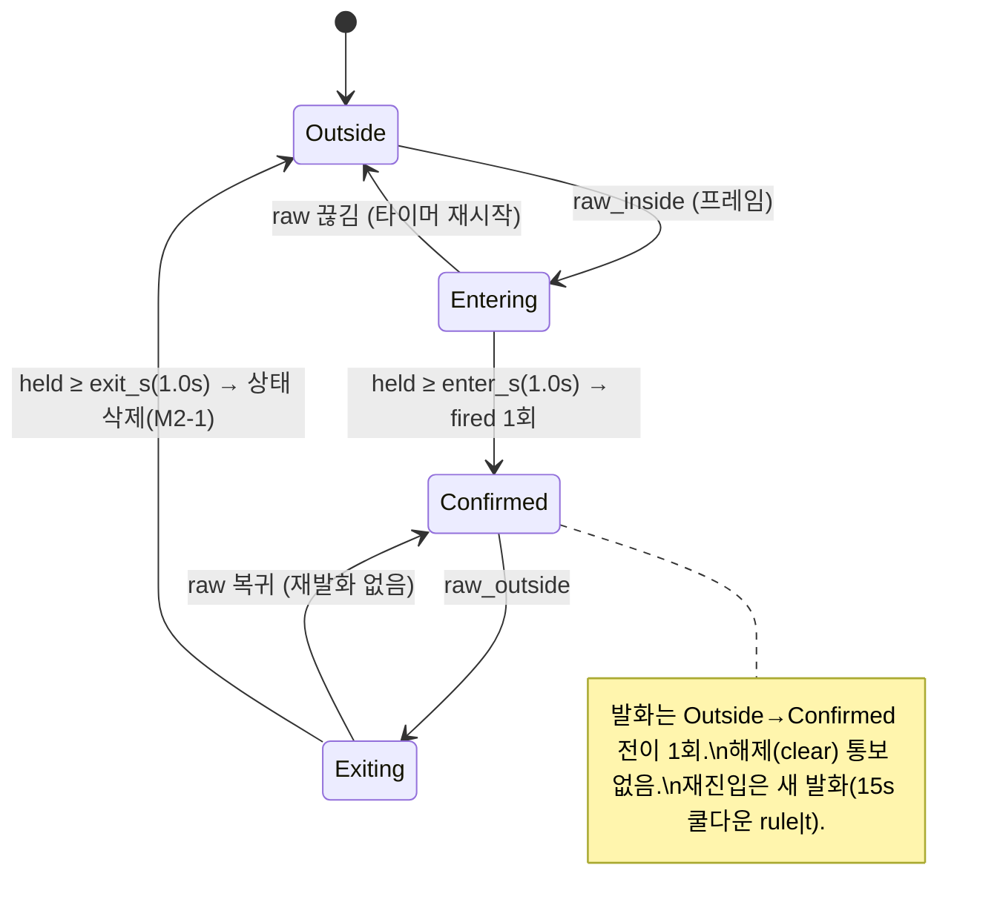
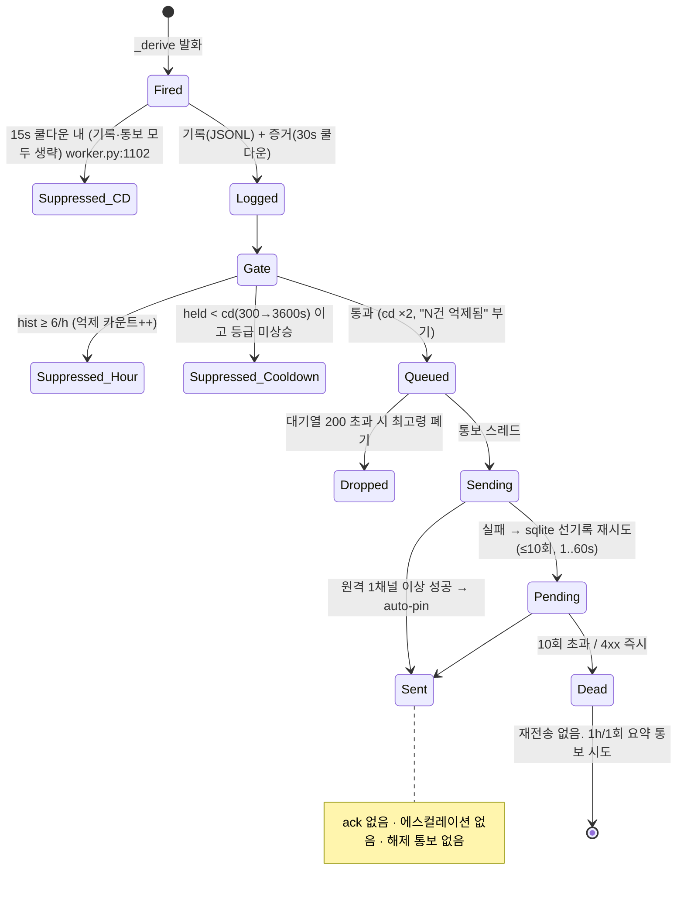
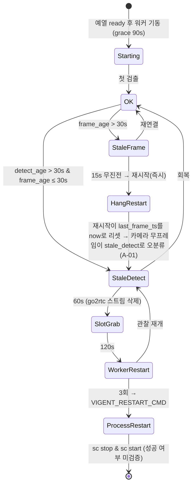

# Phase 1. 아키텍처 및 안전 설계 검토 — VIGENT

- 검토일: 2026-09-08 · 대상 커밋: `b7f49d9` (브랜치 `audit/cleanup-20260906`)
- 검토 방식: **코드 정독·grep·정적 추적만**. 서버 미기동, 테스트 미실행(테스트 스위트가 `data/`·`logs/`를 건드릴 가능성이 있어 이번 검토에서는 제외 — 기존 리포트의 "662 tests OK"는 재검증하지 않았다). `data/`·`logs/`·`config/`·`.env` 미접근. 비밀값 미열람·미기록.
- 기존 검토 문서(CODE_REVIEW.md, AUDIT_REPORT.md, docs/STABILITY.md, docs/review/01_현황.md 등)는 참고만 하고, 아래 근거는 전부 **현재 코드 줄**로 다시 확인한 것이다. 코드로 확인하지 못한 것은 "**확인 필요**"로 표시했다.
- 배포 전제: Windows NSSM 서비스(`deploy/windows/install_service.ps1`), RTSP 카메라 4대, `VIGENT_CAPTURE_MODE=thread`(서비스 env, `install_service.ps1:160`).

---

## 0. 요약 (한 줄)

앱 **내부** 복구 장치(감독자 재시작·hang 워치독·재연결·기아 3단계·경보 내구 큐·기동 실패 통보)는 코드로 확인됐다. 그러나 이 장치들이 수렴하는 지점이 `/health` 하나인데, **Windows 배포에는 `/health`를 읽는 주체가 없고**, 카메라 단절·슬롯 사망·예열 실패·워커 전멸 같은 "감시 중단"을 **원격으로 알리는 코드 경로가 0건**이다. 게다가 카메라 1대의 장기 단절이 hang 워치독의 오판을 거쳐 **전체 프로세스 재기동으로 승격**되는 경로가 코드상 존재한다(§1-2, A-01). 설치 전 반드시 막아야 할 P0 3건, P1 8건.

---

## 1. 파이프라인 요약과 장애 시나리오

### 1-1. 파이프라인(코드 경로)

```
RTSP ─► _StreamCapture(카메라별 스레드, 최신 1프레임 슬롯)   worker.py:628-737
      ─► Worker._loop (0.5s 간격, fps 2)                    worker.py:1205-1310
      ─► with DETECT_LOCK: guard.detect(풀세트 2fps)         worker.py:1007-1053, app_state.py:35(RLock)
      ─► _derive: zone/proximity 디바운스·PPE/화재 히스테리시스·군집  worker.py:224-343
      ─► MotionTracker(무동작·급이동) / 포즈 스레드(근골격, 통보 없음)  worker.py:500-625, 946-971
      ─► 15s 쿨다운(rule|subject) → data_engine.log_event(JSONL+증거 JPEG)  worker.py:1096-1118
      ─► alert_notify.submit → alert_gate(300s→3600s 백오프, 6건/h)    alert_notify.py:495-540, alert_gate.py:641-689
      ─► 통보 스레드 1개 → dispatcher.dispatch → alert_queue(sqlite 선기록) → 텔레그램/이메일/웹훅 → relay
                                                       dispatcher.py:206-307, alert_queue.py:83-155
      ─► 재시도 스레드(5s 주기, 백오프 1..60s, 10회 후 dead)             alert_queue.py:329-352
감시:  _hang_watch(15s) · _run_supervised(재시작) · starvation_guard(60/120s/3회) · readiness(예열) · /health(503)
```

기동 순서(`main.py:466-545`): 안전망 → 테마 로드(필수) → go2rtc(선택) → 예열 스레드(필수, 성공 시에만 워커 자동복원) → 기아 감시(선택) → 경보 큐(필수) → 통보 스레드(필수) → 보존 스윕(선택). `_required` 실패는 `_notify_startup_failure`(상태파일·이벤트로그 1000·원격 통보 1h/1회) 뒤 재raise(`main.py:445-453`).

### 1-2. 장애 시나리오 표

"관리자가 아는가"는 **아무도 화면을 보고 있지 않을 때**를 기준으로 판정했다(무인 운영 전제). 원격 통보 코드는 `alert_notify.submit` 호출부 7곳(`worker.py:1125`, `alert_queue.py:184`, `privacy.py:205`, `routers/dispatch.py:38`, `routers/safety_core.py:551,670`, `routers/zone.py:125`)과 `main._send_startup_alert`(`main.py:366-380`)뿐이며, **health 상태 전이를 통보하는 코드는 없다**(grep `alert_notify.submit(` 전수).

| # | 시나리오 | 코드 경로 | 실제 동작(코드 추적) | 관리자가 아는가 | 심각도 |
|---|---|---|---|---|---|
| S1 | 카메라 1대 **단기** 단절(<15s) | `_StreamCapture._run` 읽기실패 5회→release→백오프 1→2→4→5s 재오픈(`worker.py:693-711`, 상한 `_RECONNECT_MAX=5`, `:55`) · 열기/읽기 타임아웃 5s(`:74,85-87`) | 캡처 스레드 안에서 재연결. 실측 복구 6.0/8.1/49.6/8.2s(`audit/reconnect_test_2026-08-16.md`) | 로그(WARNING)만. `/health.cameras[].reconnects` 증가 | 정상 동작 |
| S2 | 카메라 1대 **장기** 단절(≥ 약 2분) 또는 **IP 변경** | ① 슬롯 정지→`last_frame_ts` 정체→15s 후 hang 판정·재시작(`worker.py:882-897`) ② 재시작 시 감독자가 `last_frame_ts=now`(`:917`) → 새 캡처가 프레임을 못 받으면 `frame is None`으로 `continue`(`:1229-1234`)라 하트비트 미갱신 → **15~16s마다 hang 재시작 반복** ③ `/health`: frame_age ≤16s·detect_age>30s → `STALE_DETECT`로 **오분류**(`health_status.py:398-401`) ④ `starvation_guard`: 60s go2rtc 슬롯 해제→120s 워커 재시작→3회 후 `_escalate()`(`starvation_guard.py:114-131`) ⑤ `VIGENT_RESTART_CMD='sc.exe stop VIGENT & sc.exe start VIGENT'`를 `Popen(shell=True)`(`:100`, `install_service.ps1:155,185`) | 카메라 1대 때문에 **약 6분 후 전체 프로세스 재기동**이 코드상 발동한다. 이후 예열(~15~25s)·워커 복원·grace 90s 뒤 같은 루프 반복 → **나머지 3대가 주기적으로 눈을 감는다.** ⑤가 실제로 재기동에 성공하는지는 **미검증**(§5 A-01: `sc stop`은 비동기라 `sc start`가 STOP_PENDING 중 실패하거나, NSSM이 자식 트리(cmd.exe)를 죽여 `sc start`가 실행되지 않을 가능성 — 둘 다 코드·설정 근거만 있고 실측 없음. 성공하지 못하면 서비스는 **STOPPED로 남고 NSSM은 재시작하지 않는다**) | `/health` 503 · 로그 ERROR "HANG 감지" 16s마다. **원격 통보 없음**. 3단계가 서비스 정지로 끝나면 `/health`도 사라진다 | **P0** (A-01) |
| S3 | **카메라 4대 전부** 단절(카메라망 스위치·PoE 다운) | S2와 동일 경로가 4대에서 동시 진행 | 4대 모두 stale → `overall=UNHEALTHY`(`health_status.py:478-480`) → 503. 6분 뒤 3단계 프로세스 재기동(S2와 동일) | `/health` 503만. **원격 통보 없음** | **P0** (A-02) |
| S4 | **인터넷** 단절(카메라망 정상) | 즉시 전송 실패→`alert_queue` pending→재시도 5s 주기·백오프 1,2,4,8,16,32,60,60,60s(`alert_queue.py:148-149`, `max_attempts=10` `tuning.yaml:33`) | 검출·기록·증거 정상. 경보는 **약 4.5~5.5분 안에 복구되지 않으면 dead**(`:142-146`). `due()`는 PENDING만 고르므로(`:214-217`) **복구 후 dead는 영영 재전송되지 않는다**. dead 요약 통보(`:181-207`)는 같은 단절 속에서 큐에 들어가 함께 죽는다. 릴레이(사이렌)는 원격 3채널 타임아웃(6+8+6s) **뒤에** 호출(`dispatcher.py:269-299`) | `/health.alerts.dead_1h`로 1시간만 degraded. 단절 중 발생한 경보를 사후에 아는 방법은 대시보드/DB 확인뿐 | **P1** (B-01, B-02) |
| S5 | **GPU OOM / 추론 예외**(일시) | `model.detect` 예외→스트릭 3회에 `slot_degraded`(`guard.py:975-993`, 임계 `:277`) → `/health.slot_degraded` · person이면 UNHEALTHY(`health_status.py:473-475`) | 다음 프레임에 재시도(자동 복구 로그 `:994-999`). `torch.cuda.empty_cache` 등 복구 조치 없음(grep 0). `last_detect_ts`는 슬롯 실패와 무관하게 갱신(`worker.py:1049`)되므로 `stale_detect` 아님 → 기아 감시 **미발동** | `/health` 503만. 원격 통보 없음 | **P1** (B-04) |
| S6 | 슬롯 **로드 실패**(가중치 손상·CUDA 초기화 실패, 영구) | `_get_model` 실패 캐시(`guard.py:900-905`) → 매 프레임 스트릭→DEGRADED, "재시작 필요"(`:930-961`) | 자동 복구 없음. person이면 침입·근접·무동작 전부 무력 | `/health` 503만 | **P0** (A-02와 동일 결함) |
| S7 | **예열 실패**(필수 가중치 없음·첫 추론 예외) | `readiness.warmup` → `FAILED`(`readiness.py:269-275, 306-309`), `on_ready` 미호출(`:318-324`) → 워커 0대 | 프로세스는 살아 있고 `/health` `phase=failed` 503(`routers/system.py:189-192`). **재시도 없음·재raise 없음·통보 없음**(`_required("readiness")`는 스레드 시작만 감싼다 `main.py:517`). NSSM은 프로세스가 살아 있어 재시작 안 함 | `/health` 503만 | **P0** (A-03) |
| S8 | **디스크 풀** | `log_event` OSError 삼킴·`logged:false`(`data_engine.py:181-187`), 증거 저장 실패 삼킴(`:62-68`), sqlite INSERT 실패는 `dispatch`가 삼킴(`dispatcher.py:224-228`) | 검출·즉시 통보 계속. **이벤트·증거·재시도 큐 소실**. 여유공간 경고(5GB, `retention.py:102,285-290`)는 24h 스윕 때만 계산·`/health.disk_retention.warnings`에 실림 | 통보 없음. 24h 뒤 `/health` 경고 | **P1** (B-05) |
| S9 | `alert_queue.db` **손상** | `_db()` CREATE TABLE 예외 → `alert_queue.start()`의 `pending_count()`(`alert_queue.py:349`)가 **try 밖** → `_required("alert_queue")` 재raise(`main.py:528`) | **기동 실패 루프**(NSSM 60s 재시작, `install_service.ps1:141`). M4-5 경로로 이벤트로그 1000 + 원격 통보 1h/1회는 나간다 | 통보됨(첫 실패 즉시) — 단 사람이 DB를 지우기 전까지 감시 공백 | **P1** (B-06) |
| S10 | `alert_queue.db` **잠금**(외부 프로세스 동시 접근) | `sqlite3.connect(check_same_thread=False)` 기본 busy timeout 5s, WAL 미설정(`alert_queue.py:60`) | 프로세스 내부는 RLock으로 직렬화. 외부 CLI(`scripts/retention_sweep.py`)와 겹치면 "database is locked" → 재시도 스레드 예외는 로그 후 계속(`:338-339`), `dispatch`는 삼킴 | 로그만 | P3 |
| S11 | **프로세스 크래시**(정상 기동 후 네이티브 크래시 등) | NSSM `AppExit Default Restart`, `AppRestartDelay 60000`, `AppThrottle 180000`(`install_service.ps1:140-142`) | 60s 뒤 재시작 + 예열 ~15~25s + grace → **약 1.5~2분 공백**. 반복 크래시라도 기동 자체가 성공하면 M4-5 통보 없음 | `service_status.ps1` 종료코드 4(회전 파일 ≥10/h, `:392-408`)는 **사람이 실행할 때만**. 원격 통보 없음 | **P1** (B-03) |
| S12 | **기동 실패**(import 단계·`_startup` 단계) | 런처 `service_entry.py:333-348`(ID 1001) · `main._notify_startup_failure`(ID 1000, `main.py:383-416`) | 상태파일·이벤트로그·원격 통보(1h/1회) 뒤 종료 → NSSM 60s 재시작 루프 | **통보됨**(채널 설정 시). 이벤트로그 `eventcreate` 서비스 계정 경로는 코드 주석상 미검증(`main.py:343`) | 설계 OK |
| S13 | 워커 스레드 **예외/hang** | `_run_supervised` 백오프 1→30s 재시작(`worker.py:904-944`), hang은 즉시(`:932-935`) | 자동 복구. `restarts`·`hangs` 카운터 | 로그·`/status` | 설계 OK |
| S14 | go2rtc **슬롯 경쟁**(카메라 세션 한도 2) | 1차 백오프 5s(`worker.py:55`), 2차 `starvation_guard` 1단계 슬롯 회수(`:46-61`) | 실측 4/4 복구(1차만 발동, 2차 실환경 **미실시** — `audit/reconnect_test_2026-08-16.md` "미실시·잔여") | 로그·`/health` | 설계 OK(2·3단계 미실측) |
| S15 | 통보 **설정 오류**(4xx) | `_classify_http` config_error → 즉시 dead(`dispatcher.py:109-121`, `alert_queue.py:306-308`) | 재시도 안 함. `/health.alerts.last_config_error` | `/health`·`service_status.ps1` 문자열만 | P2 |
| S16 | 통보 **대기열 폭주**(200건 초과) | 최고령 폐기(`alert_notify.py:521-535`) | 최신 우선. `/health.alerts.dropped` 경고 | `/health`만 | 설계 OK |
| S17 | **재부팅·정전 복구** | 서비스 지연 자동 시작(`install_service.ps1:132`), `autostart_enabled()`로 enabled 카메라 복원(`routers/cameras.py:426-437`) | 무조작 기동. 실측 T2 PASS(`audit/human_tests_2026-08-20.md:27-42`) | — | 설계 OK |
| S18 | 운영자가 **수동 `sc stop`** 후 잊음 | NSSM은 SCM 정지를 재시작하지 않음(설계상 당연) | 무기한 감시 공백 | **아무도 모름**(외부 감시 없음) | A-02에 포함 |

---

## 2. 알람 지연 예산 (위험 발생 → 통보 도달)

fps 2 = 루프 간격 0.5s(`worker.py:1145,1296`). "실측"은 저장소 문서에 측정값이 있는 경우만 표시했고, 구성·날짜는 해당 문서 기준이다(현 운영 구성과 일치하는지는 규칙 9에 따라 재확인 필요).

| 단계 | 설계 상한(코드) | 근거 | 실측 여부 |
|---|---|---|---|
| ① 카메라 내부 인코딩·RTSP 전송 | 코드 밖. 캡처 스레드는 grab 드레인으로 큐 잔량을 비움(최대 60프레임/≈4s 상한) | `worker.py:679-687`, FFmpeg `nobuffer·low_delay·max_delay 0.5s`(`:68`) | 부분 — `docs/glass_to_glass_measurement.md:12` "박스나이 42ms + RTT 68ms ≈110ms"(표시 경로). 카메라 자체 지연은 **확인 필요** |
| ② 슬롯 → 루프 소비 | ≤ 0.5s(루프 간격) + 0.05s 폴링 | `worker.py:1226-1236, 1296-1297` | `/health.cameras[].read_ms`·`slot_age_s` 노출(`:859`), 값 문서 없음 |
| ③ `DETECT_LOCK` 대기 | 4대 × 풀세트 2fps 직렬화. 최악 ≈ 3 × 추론시간 | `worker.py:1007`, `app_state.py:35` | 실측: E1 락대기 p50/p95 표(`benchmarks/e1_bottleneck_report.md:81-108`, "가끔 터지는 지연"). N=4에서 병목 아님 |
| ④ 추론(풀세트 3슬롯) | — | `guard.py:907-1090` | 실측(개발 PC): p50 56.6ms·p95 102.5ms(1대), 4대 p50 93.0ms(`benchmarks/v1_slot_config_report.md:37-41`); ORT 튜닝 후 실카 p95 85.8ms(`e1_bottleneck_report.md:63`). **파일럿 노트북(CPU) 값은 미측정**(`docs/LAPTOP_SIZING_PILOT4.md`) |
| ⑤ 규칙 확정(디바운스·히스테리시스) | 위험구역 `enter_s 1.0s`(+ 다음 프레임 0.5s ⇒ 1.0~1.5s) · 근접 `0.4s`(2프레임 연속 ⇒ 0.5~1.0s) · PPE 3프레임(1.0~1.5s) · 화재 2프레임(0.5~1.0s) · 무동작 45s · 근골격 3s(통보 없음) | `zone_debounce.py:744-750`, `tuning.yaml:38-44,239-240`, `guard.py:290`, `worker.py:503` | 설계값. 재생 검증 근거는 `benchmarks/w1w2_alert_wiring.md`(미재검증) |
| ⑥ 기록·증거 JPEG(동기) | 얼굴 모자이크+JPEG 인코딩이 워커 스레드에서 동기 실행 | `worker.py:1113-1118`, `_frame_to_dataurl :182-201` | 미측정(증거 쿨다운 30s로 빈도만 제한) |
| ⑦ 통보 게이트 | 첫 발화 0s. 반복은 300s → ×2 → 3600s 상한, 시간당 6건 | `alert_gate.py:653-689`, `tuning.yaml:7-21` | 재생 검증(89.1% 억제) 문서값, 미재검증 |
| ⑧ 통보 대기열 → 전송 스레드 | `put_nowait` μs. 스레드 1개가 **직렬** 처리: 텔레그램 6s + 이메일 8s + 웹훅 6s 타임아웃 ⇒ 건당 최악 ≈ 20s, N건 적체 시 N×20s | `alert_notify.py:435-458`, `dispatcher.py:166-202` | 실측(현장 2026-08-27, n=19): 최소 1.2s·**중앙값 1.8s**·최대 3.7s(`benchmarks/field_academy_2026-08-27.md:97-103`) |
| ⑨ 릴레이(사이렌, critical만) | 원격 3채널 **뒤에** 호출 ⇒ 인터넷 장애 시 최대 ≈ 20s 지연 | `dispatcher.py:269-299`, `relay.py:105` | 미측정 |
| ⑩ 재시도(실패 시) | 5s 드레인 주기 + 백오프 1..60s, 10회 ⇒ 총 ≈ 4.5~5.5분 후 dead | `alert_queue.py:148-149,342` | 미측정 |

**설계상 end-to-end(위험구역 침입, 정상 네트워크)**: 최선 ≈ 0.1(①②) + 0.06(④) + 1.0(⑤) + 0.5(다음 프레임) + 1.2(⑧) ≈ **2.9s**; 중앙값 추정 ≈ 3.5~4s(⑧ 중앙값 1.8s 적용); 최악(무장애) ≈ 0.5 + 0.3 + 1.5 + 20(⑧ 타임아웃) ≈ **22s**, 적체 시 그 배수. **이 end-to-end 값은 계산값이며 실측되지 않았다.** ⑧만 실측됐다.

큐가 밀렸을 때의 최신 우선 정책: 캡처 슬롯은 최신 1프레임만 보관(`worker.py:717-719`), 통보 대기열은 최고령 폐기(`alert_notify.py:521-528`) — 둘 다 코드로 확인. 단 서비스 env가 `thread`인 반면 코드 기본값은 `sync`(`worker.py:1186`)라 `run.ps1`·env 누락 실행에서는 FFmpeg 버퍼 누적 경로가 된다(`install_service.ps1:160`, `deploy/windows/README.md:16`은 run.ps1이 채운다고 명시 — run.ps1 내용은 이번에 미확인).

---

## 3. 규칙 엔진 설정성

| 규칙/항목 | 저장 위치 | 하드코딩 vs 설정 | 카메라별 | 런타임 반영(재시작 없이) | 근거 |
|---|---|---|---|---|---|
| 위험구역 폴리곤 | 카메라 등록부 `data/cameras.json` `zone`(정규화) · 전역 시드 `config/danger_zone.json`(빈 목록) | 설정 | **예** | **예** — `POST /cameras/{id}/zone`이 워커를 stop→start(`routers/cameras.py:235-251`) | `worker.py:1163-1178`, `tuning.yaml:230` 전역 폴백 기본 off |
| 프레스 방호구역(`machine_hazard_zones`, guard_bypass critical) | `config/machine_zone.json`(빈 목록) | 설정 | 아니오(테마 전역) | 브라우저 `/detect/frame` 경로만 사용(`routers/detect.py:174`). **서버 워커 경로에는 없음**(`worker.py` grep 0) | §7 Q2 |
| `config/zones.json`(픽셀 좌표·이름) | — | — | — | **어떤 코드도 읽지 않음**(grep 0) — 잔재 | P3 |
| 구역 디바운스 enter/exit·기준점 | `tuning.yaml zone.*` | 설정 | 아니오 | 아니오 — `tuning.cfg()` 1회 캐시(`tuning.py:415-419`), 파일 주석도 "재시작 시 적용"(`tuning.yaml:2`) | |
| 근접 반경·enter/exit·장비 기준폭·운전자 제외 | `tuning.yaml proximity.*` / env `VIGENT_RADIUS_M` | 설정 | 아니오 | 아니오(캐시) | `proximity.py:463-486`, `worker.py:323` |
| 체류 시간 | **없음** — 침입은 진입 전이 1회 발화, 체류 N분 경과 규칙 없음 | — | — | — | `worker.py:281-312` |
| 시간대별 규칙(작업시간·야간) | **없음**(grep `time_window|work_hours|weekday|night` 0건) | — | — | — | P2 |
| PPE 필수 항목 | ① 워커: `guard.PPE_REQUIRED` ← `tuning.yaml ppe.required`(기본 3종, `guard.py:426-436`) ② 브라우저 `/safety/ppe/*`: `config/ppe_rules.yaml`→`data/config/ppe_rules.yaml`(`ppe_check.py:186-211`) | 설정이나 **출처가 둘** | 아니오 | ①아니오 ②예(매 호출 읽음) | 워커와 브라우저가 다른 필수 목록을 볼 수 있음 |
| PPE/화재 히스테리시스 프레임 | `tuning.yaml detect.hysteresis_frames`(0=기본 ppe3·fire2) | 설정 | 아니오 | 아니오 | `guard.py:290,411-413` |
| 검출 임계(conf) | `tuning.yaml detect.conf.*` | 설정 | 아니오 | 아니오 | |
| 무동작 임계 | `tuning.yaml motion.immobile_s` · 카메라별 `overrides.motion.immobile_s` | 설정 | **예(이 1키만)** | 예(워커 재시작 시) | `camera_registry.py:258` `_OVERRIDE_KEYS` = 1개 |
| 군집 임계 | `tuning.yaml crowd.threshold` / env | 설정 | 아니오 | 아니오 | `worker.py:341` |
| 검출기 슬롯 on/off | `tuning.yaml detect.include_*` / env | 설정 | 아니오 | 아니오 | `worker.py:118-130` |
| 쿨다운(기록 15s·증거 30s) | `tuning.yaml detect.cooldown_s` | 설정 | 아니오 | 아니오 | `worker.py:92-95` |
| 통보 게이트·큐·재시도 | `tuning.yaml alerts.*` | 설정 | 아니오(키는 cam+rule이지만 값은 전역) | 아니오 | |
| 통보 채널 | `config/notify.yaml` / `.env` | 설정 | — | **예**(매 전송 시 읽음 `dispatcher.py:34-62`) | |
| 현장(site.yaml) | `POST /site/config` | 설정 | — | 워커 재시작 필요(`setup_console.write_site` 확인 필요) | |
| 등급→동작 배선 | `themes/safety/vision.yaml:120-125` | 설정 | 아니오 | 아니오 | `mid`(군집·급이동)는 log 전용 |

요약: **카메라별로 바꿀 수 있는 것은 구역·fps·무동작 임계 3가지뿐**이고, 나머지 임계는 전역이며 재시작이 필요하다. 4대가 서로 다른 장면(실내 프레스/야외 지게차)을 보는 배치에서는 한 값으로 타협해야 한다.

---

## 4. 상태 머신 (mermaid)

### 4-1. 위험 판정 → 통보 (카메라·규칙 단위)





### 4-2. 워커·검출 생존



---

## 5. 이슈 목록

형식: [심각도 / 제목] · 근거 · 영향 · 권장 조치 · 공수(S/M/L)

### P0 — 설치 전 필수

**A-01 [P0] 카메라 1대 장기 단절이 hang 오판을 거쳐 전체 프로세스 재기동으로 승격되고, 그 재기동 명령이 서비스를 정지 상태로 남길 수 있다**
- 근거:
  - hang 재시작이 하트비트를 `now`로 리셋(`worker.py:917`) → 새 캡처가 프레임을 못 받으면 `continue`만 하고 하트비트 미갱신(`:1229-1234`) → `_hang_watch`가 15s마다 재판정(`:882-897`). `started_at`은 `start()`에서만 설정(`:814`)이라 grace는 최초 1회만.
  - `health_status.camera_status`: `frame_age ≤ 30 & detect_age > 30` ⇒ `STALE_DETECT`(`health_status.py:398-401`). 위 루프에서 frame_age는 항상 ≤16s.
  - `starvation_guard._tick`은 `STALE_DETECT`만 보고 60/120s/3회 뒤 `_escalate()`(`starvation_guard.py:114-131`), `Popen("sc.exe stop VIGENT & sc.exe start VIGENT", shell=True)`(`:100`, `install_service.ps1:155,185`).
  - 기존 관측과 부합: "죽은 주소로 15초마다 재접속하며 /health 를 영구 unhealthy"(`routers/cameras.py:124`), "카메라 IP 변동 → 검출 영구 정지"(`deploy/SITE_CHECKLIST.md:19`). 2·3단계 실환경 발동은 **미실시**(`audit/reconnect_test_2026-08-16.md` 잔여 표). `tests/test_starvation_guard.py:75-84`는 `_escalate`를 mock으로 대체해 명령 실행 결과를 검증하지 않는다.
  - `sc stop`은 정지 제어를 보내고 즉시 반환하므로 곧바로 실행되는 `sc start`는 STOP_PENDING 상태에서 실패할 가능성이 크고, NSSM이 앱 종료 시 자식 프로세스 트리를 함께 종료하면 cmd.exe가 `sc start`에 도달하지 못한다 — **두 가정 모두 미실측(확인 필요)**. 어느 쪽이든 실패하면 SCM 정지이므로 NSSM `AppExit Restart`는 적용되지 않는다.
- 영향: 카메라 1대 케이블 단절·IP 변경만으로 약 6분마다 4대 전체가 재기동되거나, 최악의 경우 서비스가 STOPPED로 남아 **무기한 무감시 + 무통보**.
- 권장 조치: ① `_hang_watch`에서 "프레임 0건(캡처 재연결 중)"을 hang과 구분(예: `streamcap.alive() and frame is None`이면 hang 판정 제외, 또는 재시작 시 하트비트를 리셋하지 않고 `hang_since`를 별도 기록) ② `health_status`에 "프레임 없음" 신호(`slot_age_s`/`capture generation`)를 넣어 `STALE_FRAME`로 정확히 분류 ③ 3단계 재기동은 프로세스 밖(작업 스케줄러·NSSM 재시작 exit 코드 등)으로 옮기거나, 최소한 `sc stop`이 아닌 `os._exit(3)` + NSSM `AppExit 3 Restart`로 바꿔 SCM 정지가 아닌 앱 종료로 처리 ④ 실카메라 단절 5분 시험을 절차서에 추가. 공수 **M**.

**A-02 [P0] "감시 중단"을 원격으로 알리는 경로가 없다 — 모든 장애 판정이 `/health` 503으로 수렴하는데 Windows 배포에는 `/health`를 읽는 주체가 없다**
- 근거: `install_service.ps1`에 `schtasks`/`Register-ScheduledTask` 0건(grep, `deploy/` 전체 0건); `deploy/watchdog.sh`·systemd 타이머는 Linux 전용(`deploy/DEPLOYMENT.md:13-15`); `service_status.ps1`은 수동 실행 도구(`md/DEPLOYMENT.md:482` "작업 스케줄러 등에서 종료코드 ≥3 을 감시하면 된다" — 등록물 없음). 원격 통보 발생원 8곳(§1-2 서두) 중 health 상태 전이·카메라 stale·슬롯 degraded·예열 실패·워커 전멸을 통보하는 것은 **0건**. `readiness.FAILED` 소비처는 `routers/system.py:191` 하나.
- 영향: S3·S5·S6·S7·S11·S18 전부 "프로세스는 Running, 검출은 0, 아무도 모름". 이 프로젝트가 스스로 최악으로 규정한 고장 모드(`health_status.py:329-337`)가 **밖으로 나가는 문이 없다**.
- 권장 조치: ① 앱 내부에 health 전이 통보기 추가 — `overall`이 healthy→degraded/unhealthy로 바뀌거나 N분 지속되면 `alert_notify.submit(cam="system", rule="health_<state>", level="critical")`(기존 게이트·큐를 그대로 탄다; 회복 시 1회 "복구" 통보) ② 프로세스 밖 하트비트: 작업 스케줄러에 `service_status.ps1` 1~5분 주기 등록 + 종료코드 ≥2 시 통보(텔레그램 curl) — 프로세스 자체가 없을 때(S11·S18·A-01 최악)를 잡는 유일한 층 ③ 가능하면 외부(클라우드/관제)로의 주기 하트비트("N분간 못 받으면 경보")를 두어 PC·전원·네트워크 사망까지 포착. ①은 **S**, ②는 **S**, ③은 **M**.

**A-03 [P0] 예열 실패는 조용하다 — 프로세스는 살고 워커는 0대, 재시도·통보·재기동 없음**
- 근거: `readiness.warmup` FAILED 경로(`readiness.py:269-275, 306-309`)는 로그+상태만; `start_background`는 실패 시 `on_ready` 미호출(`:318-324`); `main._required("readiness", ...)`는 스레드 시작만 감싼다(`main.py:517`). 필수 가중치 부재(F-8·M4-5의 원 사고 유형)는 이제 예외가 아니라 이 경로로 들어온다(`readiness.py:236-255`). 테스트 `tests/test_readiness_warmup.py:76-99,125-131`은 FAILED 상태만 확인하고 통보를 요구하지 않는다.
- 영향: 설치 당일 가중치 누락·GPU 드라이버 오류·일시적 CUDA 초기화 실패가 곧 **무기한 무감시**. M4-5가 막았다고 믿는 사고가 다른 문으로 다시 들어온다.
- 권장 조치: FAILED 시 `_notify_startup_failure`와 같은 경로(상태파일·이벤트로그·원격 통보)를 타고, 정책을 정해 ① 재raise로 기동 실패 처리(NSSM 재시작 루프 + 1h 통보) 또는 ② N회 예열 재시도 후 실패 확정. 공수 **S**.

### P1 — 운영 신뢰성

**B-01 [P1] 인터넷 단절 5분이면 경보가 영구 소실된다(dead 후 재전송 없음, 요약 통보도 같이 죽음)**
- 근거: 백오프 1,2,4,8,16,32,60,60,60s + 5s 드레인 ⇒ 10회 소진 ≈ 4.5~5.5분(`alert_queue.py:47-52,148-149,342`, `tuning.yaml:33-34`); `due()`는 PENDING만(`:214-217`); dead 요약은 `alert_notify.submit`→같은 큐(`:181-187`).
- 영향: 통신 장애 중 발생한 침입·화재 경보를 관리자가 **사후에도** 못 받는다. `/health.dead_1h`는 1시간 후 사라진다.
- 권장: `max_attempts`를 시간 기반(예: 24h 동안 재시도, 백오프 상한 5~10분)으로 바꾸고, 네트워크 회복 감지 시 dead를 pending으로 되돌리는 "복구 후 일괄 재전송" + 요약 통보는 회복 시점에 발송. 공수 **S~M**.

**B-02 [P1] 릴레이(사이렌)가 원격 3채널 전송 뒤에 순차 호출된다 — 인터넷 장애 시 현장 경보가 최대 ≈20s 늦는다**
- 근거: `_dispatch_now` 순서 텔레그램(6s)→이메일(8s)→웹훅(6s)→`relay.turn_on`(`dispatcher.py:269-299`); 통보 스레드 1개 직렬(`alert_notify.py:435-458`).
- 영향: 현장에서 가장 빨라야 할 물리 출력이 가장 느린 채널에 묶인다. 4대 동시 발화 시 적체 배수.
- 권장: 릴레이를 `submit` 직후 별도 즉시 경로(또는 dispatch 최상단)로 옮기고, 원격 채널은 스레드풀 병렬 전송. 공수 **S**.

**B-03 [P1] 정상 기동 후 반복 크래시(크래시 루프)를 알리는 장치가 수동 도구뿐이다**
- 근거: 크래시 루프 검사는 `service_status.ps1:392-408`(수동 실행); M4-5 통보는 `_startup` 실패에만(`main.py:445-453`). NSSM 재시작 지연 60s(`install_service.ps1:141`) + 예열 + grace ⇒ 회당 ≈2분 공백.
- 영향: 10분마다 죽는 네이티브 크래시는 하루 144회 재시작·약 5시간 무감시인데 통보 0건.
- 권장: A-02 ②(스케줄러 등록)로 해결. 추가로 기동 시 "직전 종료가 비정상이었는가"(예: `logs/vigent.err-*` 최근 회전 수, 또는 `data/last_clean_shutdown` 마커)를 검사해 N회 이상이면 원격 통보. 공수 **S**.

**B-04 [P1] 슬롯 추론·로드 실패에 자동 복구 조치가 없다(로드 실패는 재시작 필요)**
- 근거: `guard.py:900-905`(로드 실패 캐시), `:930-961`(재시도 없음 명시), `:975-993`(추론 실패는 매 프레임 재시도만, `empty_cache`·재로드 없음, grep 0). `last_detect_ts`는 슬롯 실패와 무관하게 갱신(`worker.py:1049`) → 기아 감시 미발동.
- 영향: GPU OOM 지속·드라이버 리셋 후 person 슬롯이 죽으면 `/health` 503 외 아무 일도 없다(A-02 결합 시 무통보).
- 권장: `slot_degraded(person)` N분 지속 시 ① `torch.cuda.empty_cache()` + 슬롯 재로드 1회 ② 실패 시 프로세스 자진 종료(exit 코드) → NSSM 재시작. 공수 **M**.

**B-05 [P1] 디스크 풀에 대한 사전 경보가 없다(24h 스윕 때만 계산, 통보 없음)**
- 근거: `retention.py:102`(5GB 임계), `:285-290`(sweep 안에서만 계산), `retention_scheduler.py:38-40`(기본 86400s). 디스크 풀 시 이벤트·증거·큐 유실은 삼켜진다(`data_engine.py:181-187`, `dispatcher.py:224-228`).
- 영향: 증거 없는 경보, 재시도 불가 큐. 사고 조사 시 "기록이 없다".
- 권장: 워커 또는 health에서 1~5분 주기 `shutil.disk_usage` 검사 → 임계 미만이면 `/health` degraded + 원격 통보 1회. 공수 **S**.

**B-06 [P1] `alert_queue.db` 손상 시 기동 실패 루프**
- 근거: `alert_queue.start()`의 `pending_count()`가 try 밖(`alert_queue.py:349`) → `_required` 재raise(`main.py:528`). busy timeout·WAL 미설정(`:60`).
- 영향: 손상 DB를 사람이 지우기 전까지 60s 주기 재시작(통보는 1h/1회 나감).
- 권장: `_db()`에서 `sqlite3.DatabaseError` 시 손상 파일을 `.corrupt-<ts>`로 옮기고 새로 생성(경보는 통보); `PRAGMA journal_mode=WAL`, `timeout=`. 공수 **S**.

**B-07 [P1] 시간 동기화·시각 정합성 — NTP 확인 절차 없음, 이벤트 시각은 캡처 시각이 아니라 기록 시각**
- 근거: NTP/w32tm 언급은 `docs/CODE_REVIEW_AZ.md:355` 체크리스트 1줄뿐(deploy·scripts·SITE_CHECKLIST 0건). 이벤트 `ts = datetime.now(KST)`는 추론·규칙 판정 **후**(`data_engine.py:164-169`); 프레임 시각 `t0`(`worker.py:1222`)·슬롯 시각(`:719`)은 기록에 실리지 않는다. 카메라 측(RTSP PTS) 시각은 어디서도 읽지 않는다. KST 고정 오프셋(`data_engine.py:23`, `retention.py:30`). naive `datetime.now()` 3곳: `legal_whitelist.py:105`, `routers/dispatch.py:45`, `ml/eval_ergonomics.py:124,128`. `alert_queue`는 `time.time()`(epoch).
- 영향: PC 시계가 틀리면 증거 JPEG·JSONL·큐·카메라 OSD 시각이 서로 어긋나 **사고 조사 증거로서의 신뢰**가 깨진다. 카메라 간 정합성은 같은 PC 시계라 상대적으로는 일관되나 절대 시각은 보장 없음.
- 권장: ① `install_service.ps1`/SITE_CHECKLIST에 `w32tm /query /status` + 오차 임계 확인 추가, `/health`에 시계 오프셋(가능하면 NTP 질의) 노출 ② 이벤트 레코드에 `frame_ts`(캡처 슬롯 시각)와 `detect_latency_ms`를 함께 기록 ③ naive datetime 3곳 KST 통일. 공수 **S**.

**B-08 [P1] hang 워치독이 "카메라 무프레임"을 "워커 멈춤"으로 오진해 로그·카운터를 오염시킨다(A-01의 뿌리)**
- 근거: A-01과 동일(`worker.py:917, 1229-1234, 882-897`). 결과: 16s마다 ERROR "HANG 감지", `hangs`·`restarts` 카운터 급증, `/status.any_hang`이 카메라 장애를 hang으로 보고.
- 영향: 현장 장애 진단 오류(카메라 문제를 소프트웨어 hang으로 오인), 로그 폭주.
- 권장: A-01 ①②와 동일. 공수 **S**.

### P2 — 상용 대비 기능·성능 열위

**C-01 [P2] 알람 생명주기가 "진입 1회 통보"뿐 — 해제(clear)·확인(ack)·미확인 시 에스컬레이션·체류 시간 규칙 없음**
- 근거: `zone_debounce.py:789-813`(해제 전이는 발화 없음), `alert_gate.py`(ack 개념 없음, grep `ack|escalat` 0건), 등급 상승 예외만(`:673-679`). 체류 N분 규칙 없음(§3).
- 영향: "들어갔다"는 알지만 "아직 있다/나갔다/누가 조치했다"를 모른다. 관리자 부재 시 2차 수신자 상향 없음.
- 권장: 이벤트 id 기반 open/ack/clear 상태 + `/alerts/{id}/ack` + 미ack N분 시 2차 채널. 공수 **M~L**.

**C-02 [P2] 카메라별 설정이 구역·fps·무동작 임계 3개뿐, 임계 변경은 재시작 필요, 시간대 규칙 없음**
- 근거: `camera_registry.py:258`(허용 키 1개), `tuning.py:415-419`(1회 캐시), §3 표.
- 권장: overrides 키를 proximity/zone/ppe/crowd로 확장(정규화 함수는 이미 일반화 가능한 구조), tuning 핫리로드(`POST /system/reload` + mtime 감시), 카메라별 활성 시간대. 공수 **M**.

**C-03 [P2] 프레스 방호구역(guard_bypass, critical+릴레이)이 서버 워커 경로에 없다**
- 근거: `machine_hazard_zones`는 `routers/detect.py:174`(브라우저 `/detect/frame`)만; `worker.py` grep 0. 서버 경로에서 critical(릴레이)을 내는 규칙은 `fire_smoke`뿐(`worker.py:320-321`).
- 영향: 기획서의 §8 보조 방호신호가 "브라우저를 열어둔 동안만" 동작한다. 의도인지 확인 필요(§7 Q2).

**C-04 [P2] PPE 필수 항목의 출처가 둘(워커=tuning `ppe.required`, 브라우저=`ppe_rules.yaml`)**
- 근거: `guard.py:426-436` vs `ppe_check.py:186-211`. 현장이 UI에서 마스크를 빼도 워커는 계속 마스크 미착용을 발화(현장 실측 §7-1 `benchmarks/field_academy_2026-08-27.md` "NO-Mask 지배"와 같은 증상).
- 권장: 단일 출처로 통합(런타임 `data/config/ppe_rules.yaml` → guard 재로드). 공수 **S**.

**C-05 [P2] 단일 PC·단일 프로세스·단일 GPU — PC 자체가 SPOF이며 이를 외부에서 보는 장치가 없다**
- 근거: 아키텍처 전체(§1-1). 카메라 4대가 한 프로세스의 `DETECT_LOCK`·한 통보 스레드·한 sqlite를 공유.
- 권장: A-02 ③(외부 하트비트)이 최소 조치. 이중화는 범위 밖.

### P3 — 코드 품질·유지보수

- **D-01 [P3]** 통보 게이트 키가 카메라 **이름**(`worker.py:1126 cam=str(ctx.name)`, `manager.start name=name or cid`) — 같은 이름 2대면 억제 예산 공유. id로 바꿀 것. S.
- **D-02 [P3]** 캡처 재연결 후 슬롯의 옛 프레임이 남아 최대 15s 동안 같은 정지 프레임을 반복 추론(`worker.py:717-719`, 재오픈 시 `_frame` 미초기화 `:700-711`). 재연결 시 `_frame=None`. S.
- **D-03 [P3]** `deploy/windows/README.md:15` "5초 뒤 자동 재시작" vs `install_service.ps1:141` 60s — 문서 불일치. S.
- **D-04 [P3]** `GET /alerts/status`가 항상 `alerts: []` 스텁(`routers/safety_core.py:785-787`) — 프론트가 이를 믿으면 "경보 없음"으로 오인. 실제 큐 집계로 대체하거나 제거. S.
- **D-05 [P3]** `config/zones.json`(픽셀 좌표) 어떤 코드도 읽지 않음 — 삭제 또는 용도 명시. S.
- **D-06 [P3]** 코드 기본 `VIGENT_CAPTURE_MODE=sync`(`worker.py:1186`) vs 서비스 `thread` — 기본값을 thread로 올리고 sync는 명시 opt-in으로. S.
- **D-07 [P3]** `_hang_watch`의 grace 기준 `started_at`이 재시작에서 갱신되지 않음(`worker.py:814,889-891`) — 재연결·재시작 직후 콜드 비용을 grace가 못 덮는다(주석 `:885-888`의 의도와 어긋남). S.

---

## 6. 경쟁 상용 제품 대비 격차(아키텍처 관점)

아래는 산업안전 CCTV/VMS 계열 제품에서 **일반적으로 기대되는 구성**과의 비교이며, 특정 제품의 사양을 확인해 적은 것은 아니다(일반론 — 개별 제품 미검증).

| 항목 | 상용 제품에서 일반적으로 기대되는 것 | VIGENT 현재(코드 근거) | 격차 |
|---|---|---|---|
| 감시자 감시(watch the watcher) | 중앙 관제/클라우드로의 주기 하트비트, 미수신 시 경보; 장치·카메라 오프라인 알림 | `/health` 503만, 소비자 없음(A-02) | **크다** |
| 카메라 오프라인 알림 | 카메라별 연결 끊김 즉시 알림·복구 알림 | 로그·`/health.cameras[].status`만, 통보 0건 | **크다** |
| 알람 생명주기 | open→ack→clear, 담당자 배정, 미확인 시 상향, 이력 | 진입 1회 통보, 억제 요약(C-01) | 크다 |
| 통보 내구성 | 무제한(또는 장기) 재시도·복구 후 일괄 재전송 | 5분 후 dead·재전송 없음(B-01) | 중간 |
| 물리 출력 우선순위 | 로컬 출력(사이렌·경광등)은 네트워크와 무관하게 즉시 | 원격 채널 뒤 순차(B-02) | 중간 |
| 시간 동기 | NTP 강제·오프셋 감시·영상 타임스탬프 오버레이 | 없음(B-07) | 중간 |
| 규칙 설정 단위 | 카메라·구역·시간대·요일별, UI에서 즉시 반영 | 전역 tuning + 카메라별 3키, 재시작 필요(C-02) | 중간 |
| 체류·인원·구역 조합 규칙 | 체류 시간, 최대 인원, 2인 1조, 구역 간 이동 | 진입·근접·군집·무동작·급이동만 | 중간 |
| 헬스 세분화 | 카메라/추론/저장/통보/시계/디스크 각각 임계·알림 | 카메라·추론·통보·보존은 있음, 디스크·시계는 없음(B-05·B-07) | 작다 |
| 자체 복구 | 워치독·자동 재시작 | 감독자·hang·재연결·기아 3단계 있음(오분류 결함 A-01 제외) | 작다(수정 시) |
| 영상 증거 | 사건 전후 클립 보존 | 정지 JPEG 1장(30s 쿨다운) + JSONL | 중간(Phase 범위 밖) |

강점(코드로 확인): 경보 선기록 후전송(sqlite), 억제 요약("N건 억제됨"), 기록은 억제하지 않는 원칙, 기동 실패 통보·이벤트로그(1000/1001), 구역 미설정 시 판정 안 함(전역 폴백 기본 off), 자격증명 마스킹 일관성.

---

## 7. 확인 질문 (판단 유보 — 결론 내지 않음)

1. **3단계 프로세스 재기동**(`sc stop & sc start`)을 실서비스 계정에서 실제로 발동시켜 본 적이 있는가? 없다면 A-01의 "STOPPED로 남는다" 가정을 실측으로 확정/기각해야 한다(실카메라 단절 ≥6분 시험).
2. 프레스 방호구역(`machine_hazard_zones`·guard_bypass critical)이 **브라우저 경로에만** 있는 것은 의도인가(파일럿 범위가 지게차 실습장이라 서버 워커에서 뺀 것인가)?
3. 경보 재시도 정책(10회·≈5분 후 dead, 재전송 없음)은 "오래된 경보는 보내지 않는다"는 **의도된 결정**인가, 아니면 기본값 그대로인가? 복구 후 일괄 재전송을 원하는가?
4. Windows 현장에서 `/health`를 읽는 **외부 주체**(고객 NOC·작업 스케줄러·클라우드)가 설치 절차에 포함될 예정인가? 아니면 텔레그램만이 유일한 관리자 접점인가?
5. 카메라별 override를 `motion.immobile_s` 1개로 제한한 것(R15 "일반화는 다음 단계")의 우선순위는? 파일럿 4대가 동일 장면인가, 이종 장면인가?
6. 해제(clear)·ack·에스컬레이션 통보를 넣지 않은 것이 알림 피로를 고려한 의도인가?
7. 시간 동기는 Windows 기본 시간 서비스에 맡기는가? 카메라 OSD 시각과 서버 시각의 정합을 계약상 요구받는가(사고 조사 증거 요건)?
8. 릴레이를 원격 채널 뒤에 둔 순서는 의도인가(예: 원격 실패 시에만 사이렌)? 코드 주석에는 이유가 없다.
9. 예열 실패 시 정책은 "기동 실패로 취급(재시작 루프+통보)"과 "떠 있되 통보" 중 어느 쪽을 원하는가?
10. 코드 기본 `VIGENT_CAPTURE_MODE=sync`를 유지하는 이유가 있는가(파일 소스 회귀 경로 외에)?

---

## 부록. 이번 검토에서 재검증한 "이미 고쳐졌다" 주장

| 주장(출처) | 현재 코드 | 판정 |
|---|---|---|
| M4-5 기동 실패 통보·이벤트로그 | `main.py:328-416`, `service_entry.py:259-285` | 유효(단 `_startup`/import 단계만 — 예열 실패는 미포함, A-03) |
| B2 `/health`가 검출 생존을 본다 | `health_status.py:372-428`, `routers/system.py:183-186` | 유효(카메라 무프레임 오분류 A-01 제외) |
| B3 기아 2차 방어 | `starvation_guard.py` | 코드 유효, 2·3단계 실환경 미실시(audit 문서 자인) |
| B5 경보 내구 큐 | `alert_queue.py` | 유효(5분 후 dead·재전송 없음은 설계 한계, B-01) |
| F2 디스크 풀에서 기록 실패가 통보를 막지 않는다 | `data_engine.py:181-187` | 유효 |
| F5 구역 미설정 시 전역 폴백 안 함 | `worker.py:1163-1176`, `tuning.yaml:230` | 유효 |
| F6 보존 스윕 자동 실행 | `retention_scheduler.py`, `main.py:545` | 유효(선택 서비스) |
| M4-4 재시도는 원격 채널만(릴레이 재트리거 없음) | `dispatcher.py:289-291`, `main.py:525-526` | 유효 |
| M5-2 RTSP 열기/읽기 5s 타임아웃 | `worker.py:70-91` | 유효 |
| M7-3 필수/선택 기동 분리 | `main.py:445-464` | 유효 |
| "죽으면 5초 뒤 자동 재시작"(`deploy/windows/README.md:15`) | `install_service.ps1:141` = 60s | **문서 불일치**(D-03) |
