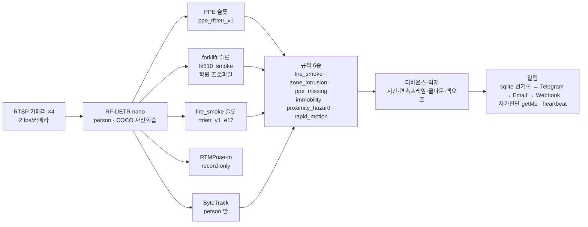
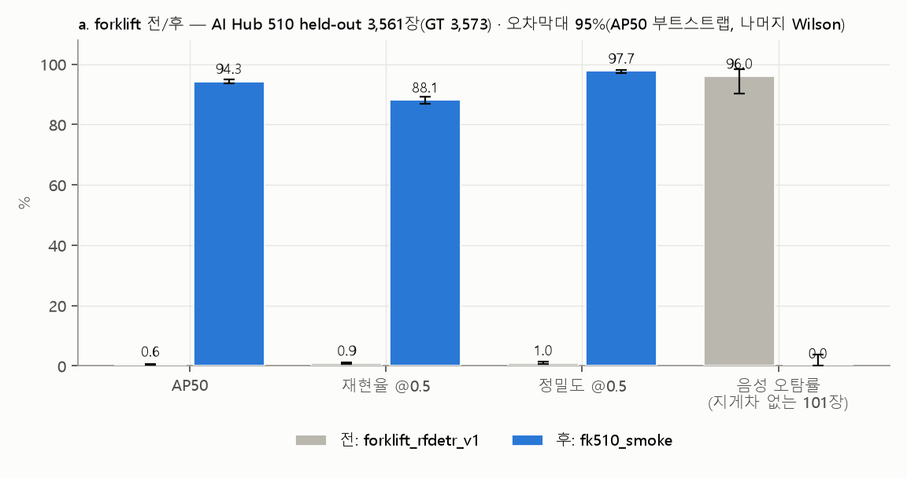
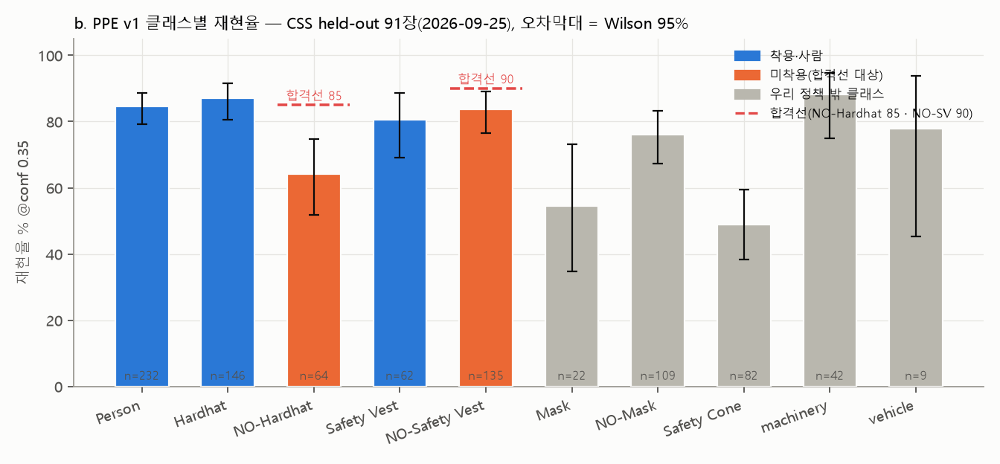
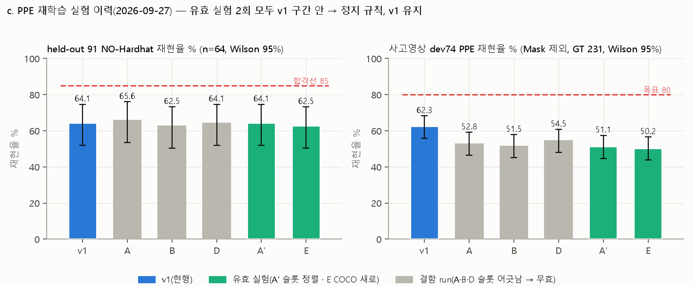
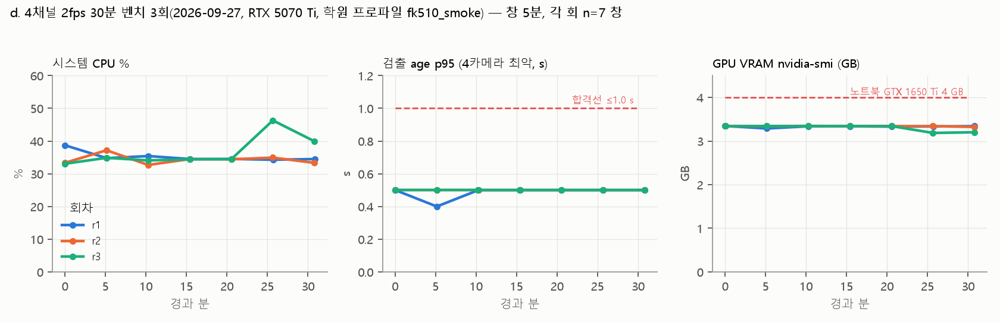
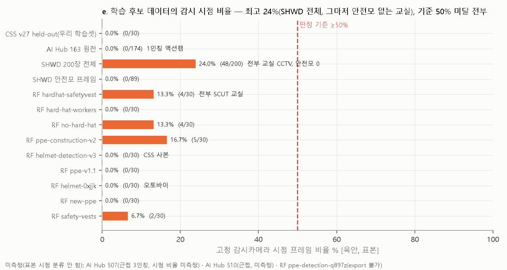
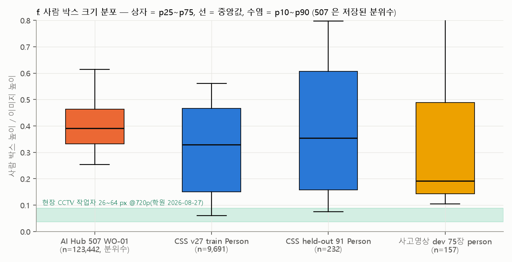

# VIGENT 알고리즘·성능 현황 보고서 (2026-09-28)

> **용도**: 멘토링·투자 자료. **원칙**: 실측만 쓴다. 추정은 `[추정]`, 미측정은 `미측정`, 문서·페이지 표기만 있는 것은 `[문서상 주장]` 으로 표기한다. 모든 수치에 원자료 파일과 **커밋 해시**를 단다(해시는 그 수치가 처음 기록된 커밋, 또는 원자료 파일이 마지막으로 바뀐 커밋). 얼굴이 찍힌 이미지는 싣지 않는다.
> **한 줄 요약**: 사람·지게차 검출과 4채널 운용은 실측으로 합격선을 넘겼다. **보호구 미착용 검출은 합격선(재현율 85/90) 미달**이고, 원인은 학습 데이터가 전부 비감시 시점이라는 점이 실측으로 확인됐다(공개 데이터 14종 + 우리 학습셋 CSS 모두 감시 시점 ≤24 %, CSS 0/30). 다음 단계는 현장 촬영 데이터로 PPE v2 를 만드는 것이며 도구는 준비돼 있다(`41e36b2`).
> 그래프 6장은 `benchmarks/results/status_20260928/` 에 있고 `scripts/report/status_graphs_20260928.py` 로 재생성된다(§8).

---

## 1. 파이프라인 구조

| 단계 | 모델 / 알고리즘 | 가중치 · SHA256 앞 8자리 | 라이선스 | 학습 데이터 출처 | 입력 해상도 · 임계 | 근거 |
|---|---|---|---|---|---|---|
| 캡처·디코드 | OpenCV FFmpeg SW 디코드, 최신 1프레임 슬롯 | — | — | — | 카메라 원 해상도, 2 fps | `ALGORITHM_TRUTH` §2-1 · `786e1e2` |
| 사람 검출 | **RF-DETR Nano COCO 사전학습 그대로**, `person` 만 통과 + PPE 슬롯의 Person 앙상블 | `rf-detr-nano.pth` `d8d6b9ee` | Apache-2.0(Roboflow RF-DETR) | COCO | 384 · conf 0.40(ByteTrack 모드 0.28 후보) | `weights_manifest.json` `694c5af` · `tuning.yaml:97-102` `a798ee8` |
| 보호구 판정 | RF-DETR Nano 파인튜닝 | `ppe_rfdetr_v1.pth` `3380fa7d` | 코드 Apache-2.0 · 데이터 CC BY 4.0 | Roboflow Universe "Construction Site Safety" v27(원본 514장, 5배 증강 2,603) — **CCTV 아님** | 384 · conf 0.35 | `vigent-core/weights/MANIFEST.md` `694c5af` · `provenance.md` §3 |
| 지게차 검출(학원 프로파일) | RF-DETR Nano 파인튜닝(2026-09-26, 시드 1개) | `forklift_rfdetr_fk510_smoke.pth` `b409c98d` | 코드 Apache-2.0 · 데이터 AI Hub 510(**상업 활용 문의 회신 대기**) | AI Hub 510 물류창고(train 8,789 / val 3,561, 장소 단위 분할) | 384 · conf 0.50 | `weights_manifest.json` `694c5af` · `docs/model/forklift_finetune_smoke_20260926.md` `fd67d6e` |
| 지게차 검출(전역 safety) | 슬롯 선언만, 검출기 목록 제외(F-7 과소학습) | `forklift_rfdetr_v1.pth` `cd76eb56` | Apache-2.0 · LOCO CC0 | LOCO 211장, MPS·NaN 학습 | — | `provenance.md` §9 `a798ee8` |
| 화재·연기 | RF-DETR Nano 파인튜닝(30 ep 중 17 ep) | `fire_smoke_rfdetr_v1_e17.pth` `b7425ce4` | 코드 Apache-2.0 · **D-Fire 라이선스 미확인** | D-Fire | 384 · fire 0.30 / smoke 0.50 | `ALGORITHM_TRUTH` §2-9 · `tuning.yaml:115-120` |
| 자세 추정(기록 전용) | RTMPose-m(rtmlib) + YOLOX-m 사람 | `rtmpose-m_simcc-body7…onnx` `5c0a4bf6` | Apache-2.0(OpenMMLab) | body7 | 256×192 | `weights_manifest.json` |
| 추적 | ByteTrack(person 만) + 자체 IoU 그리디 | — | Apache-2.0 | — | 고/저신뢰 분리 0.50 | `guard.py:315-316` |
| 규칙 | 결정적 규칙 6종 + `ergonomic_risk`(기록 전용) | — | — | — | 구역 1.0 s · 근접 0.4 s · PPE 3프레임 · 화재 2프레임 · rapid 1.0 s 창 ≥0.15 | `tuning.yaml` · `ALGORITHM_TRUTH` §2-6 |
| 디바운스·억제 | 쿨다운 15 s · 통보 반복 억제 300→3600 s 백오프 · 6건/h | — | — | — | — | `tuning.yaml:7,87` |
| 알림 | sqlite 선기록 → 텔레그램 → 이메일(SMTP) → 웹훅 → 릴레이 **순차** · 기동 시 `getMe` 자가시험 · heartbeat(설정 시) | — | — | — | 재시도 10회 후 dead | `agents/dispatcher.py:143-209` · `a01e4ae` |

## 2. 성능 표

기준일·집합·n·95 % 구간·합격선·판정을 한 줄씩. **합격선**: NO-Hardhat R ≥85 · NO-Safety Vest R ≥90(정밀도 유지) · dev74 PPE R ≥80 · forklift AP50 ≥70 · 음성 오탐 ≤1 % · 4ch age p95 ≤1.0 s.

### 2-1. 사람 검출기 (RF-DETR nano COCO)

| 지표 | 값 | 집합 · 조건 · n | 기준일 | 판정 | 원자료 · 커밋 |
|---|---|---|---|---|---|
| raw mAP@50 | **93.92 %** | 공개 이미지 74장 / 87 인스턴스 | 2026-07 | 참고(공개셋) | `benchmarks/EVAL.md:69-70` · `8052359` |
| 검출 직전 재현율 | **71.3 %** | 사고영상 dev 74장, **1 fps** 정지프레임, IoU≥0.5 | 2026-08-25 | 합격선 없음(병목이 추적임을 보인 근거) | `benchmarks/v1_field_baseline_report.md:72` · `415b959` |
| 추적 후 재현율 42.0 % | **폐기** | 같은 dev74 1 fps — 1 fps 재인코딩이 추적을 깨는 착시 | 2026-09-22 폐기 | — | `ALGORITHM_TRUTH` §4-2 · `786e1e2` |
| 앙상블 효과 | 55.4 → **70.7 %**(+15.3 %p), 정밀도 89.7 → 79.9 | dev 74장 | 2026-08-10 | — | `benchmarks/p2_person_ensemble*.md` · `f7875cc` |
| 현장 2 fps 추적 고신뢰 손실 | **3.9 %**(conf≥0.5) · 전체 손실 11.7 %(생존율 88.3) · 손실 중 **48.3 % 는 확정 지연** | 학원 34.0분 · 3,843프레임 · 1.88 fps · 카메라 1대 · **정답지 없음** | 2026-08-27 수집 / 2026-09-22 분류 | 참고(재현율 아님) | `benchmarks/b_passthru_results.md:7` · `cf8e850` |
| 야간 무인 오탐 | 86.4 %(110회 중 95회) → 화각 변경 후 100 % | 야간 무인 장면 · **유인 야간 재현율 0회 측정** | 2026-08-20 | 미측정(유인 야간) | `benchmarks/m2_night_person.md` · `6ebbf8a` |
| 단일 실카메라 검출 지연 | p50 184 ms | Tapo C200 1080p 15 fps 1대 | 2026-08-22 | — | `docs/academy_visit_day.md:669` · `d35d684` |

### 2-2. PPE v1 (ppe_rfdetr_v1) — 그래프 b·c

held-out 91장 = CSS v27 valid/test 중 train 과 영상·stem 미겹침(2026-09-25, `3249940`), @conf 0.35, Wilson 95 %.

| 클래스 | GT n | 재현율 % [95 %] | 정밀도 % [95 %] | AP50 | 합격선 | 판정 |
|---|---|---|---|---|---|---|
| Person | 232 | 84.5 [79.3, 88.6] | 81.0 [75.6, 85.4] | 86.4 | — | — |
| Hardhat | 146 | 87.0 [80.6, 91.5] | 89.4 [83.3, 93.5] | 90.2 | — | — |
| **NO-Hardhat** | 64 | **64.1 [51.8, 74.7]** | 69.5 [56.9, 79.7] | 65.8 | R ≥85 | **미달** |
| Safety Vest | 62 | 80.6 [69.1, 88.6] | 79.4 [67.8, 87.5] | 82.8 | — | — |
| **NO-Safety Vest** | 135 | **83.7 [76.6, 89.0]** | 86.9 [80.1, 91.7] | 86.3 | R ≥90 | **미달**(구간 걸침) |
| 우리 4클래스 AP50 평균 | — | — | — | **81.3** | — | — |
| 10클래스 mAP@50 | — | — | — | 76.8 | — | — |

원자료 `benchmarks/results/v1_heldout_eval.json` · `3249940`.

| 현장 유사 집합 | 값 | 조건 | 기준일 | 합격선 | 판정 | 원자료 · 커밋 |
|---|---|---|---|---|---|---|
| dev74 PPE 재현율(Mask 제외) | **62.3 % [55.9, 68.3]**(144/231) | 사고영상 dev 74장(1 fps), 앱 파이프라인 | 2026-09-27 공정 비교 | ≥80 | **미달** | `benchmarks/results/ppe_smoke_*/dev74_fair_noMask.json` `v1_noMask` · `f8e5b20` |
| dev74 PPE 재현율(전체) | 64.8 %(160/247) · 정밀도 93.6 | 같은 집합, Mask 포함 | 2026-08-10 | ≥80 | 미달 | `benchmarks/results/x4b_score_candidates.json` · `c22f5e1` |
| dev74 NO-Hardhat 재현율 | 관측 구간 **[25.9, 100]**(n=14 명확 + 40 모호) | 모호 박스 40 처리에 따라 하한/상한 | 2026-08-10 | ≥85 | **판정 불가(소표본)** | 같은 파일 `nh_lower/nh_upper` · `c22f5e1` |
| test 35장 PPE 정밀도 | 95.9 %(TP 47 / FP 2) | 1회 개봉 test | 2026-08-10 | 유지 | — | `benchmarks/v1_field_baseline_report.md:91` · `1d2b992` |
| 재학습 6회(A·B·D·A′·E) | held-out NO-Hardhat R 62.5~65.6, 전부 v1 구간 안 | A·B·D 는 슬롯 결함으로 **무효** | 2026-09-27 | — | **정지 규칙 → v1 유지** | `benchmarks/results/ppe_compare_*.json` · `cfe83de` `1eedb97` `85775da` |

### 2-3. forklift — 그래프 a

| 지표 | 전 `forklift_rfdetr_v1` | 후 `fk510_smoke` | 집합 · n | 합격선 | 판정 | 원자료 · 커밋 |
|---|---|---|---|---|---|---|
| AP50 | 0.6 [0.5, 0.7] | **94.3 [93.6, 95.0]** | AI Hub 510 held-out 3,561장(GT 3,573), 장소 단위 분할, 부트스트랩 | ≥70 | 달성 | `forklift_v1_baseline.json` `5a069de` · `forklift_fk_510_smoke_20260926/harness.json` `fd67d6e` |
| 재현율 @0.5 | 0.9 [0.6, 1.3] | **88.1 [87.0, 89.1]** | 같은 집합 | — | — | 같음 |
| 정밀도 @0.5 | 1.0 [0.7, 1.5] | **97.7 [97.1, 98.2]** | 같은 집합 | 유지 | — | 같음 |
| 음성 오탐률(510 val, 지게차 없음) | 96.0 [90.3, 98.4] | **0.0 [0.0, 3.7]** | n=101 | ≤1 % | 달성(상한 3.7 은 소표본) | 같음 |
| 음성 오탐률(VS_02 보관 원천) | 미측정 | **0.1 [0.0, 0.3]**(2/2,568) | 510 라벨상 지게차 0 프레임 2,568장 | ≤1 % | **달성** | `audit/forklift_neg_eval_VS02_20260926_2357.json`(미추적) · `docs/model/forklift_finetune_smoke_20260926.md` §3-3 · `7287bb8` |
| 음성 오탐률(507 고소작업, 도메인 다름) | 96.6 [95.7, 97.3] | 1.4 [0.9, 2.0] | n=2,000 | 참고 | — | 같은 harness.json |
| 학원 대본 기준 검출(929프레임) | 0.0 / 0.5 % | **95.7 %**(889/929) | 학원 2026-08-27 overlay, 정답 = 장면 대본 | 교체 기준 −3 %p 이내 | 달성(boda_ax YOLO 97.7 % 대비 −2.0 %p) | `docs/model/forklift_finetune_smoke_20260926.md` §3-1 · `8d8774f` |
| 주행 장면 04 / 05 | — | **86.1 / 87.0 %** | 같은 대본, boda_ax 99.3 / 92.5 | — | **저하 확인, 원인 미확인** | 같은 문서 §3-1 · `8d8774f` |

### 2-4. 운용 — 4채널 2 fps 벤치 (그래프 d)

개발기 RTX 5070 Ti · 학원 프로파일(person + PPE + fire_smoke + fk510_smoke) · 모의 파일 카메라 4대 · 30분 × 3회 · 창 5분(각 회 7창) · 2026-09-27 · `286e499` · `benchmarks/results/forklift_fk_510_smoke_20260926/bench4ch_fk2_academy_r3_summary.json`.

| 지표 | r1 | r2 | r3 | 합격선 | 판정 |
|---|---|---|---|---|---|
| 시스템 CPU 평균 / 최대 % | 34.7 / 35.4 | 34.7 / 37.2 | 36.8 / 46.3 | — | — |
| 검출 age p95(4카메라 최악) s | 0.5 | 0.5 | 0.5 | ≤1.0 | 달성 ×3 |
| 경보 지연 p95 최대 s | 0.18 | 0.15 | 0.27 | — | — |
| 추론 p50 / p95 / p99 ms | 66.3 / 158.0 / 202.0 | 59.4 / 149.1 / 205.2 | 64.1 / 92.1 / 108.9 | — | — |
| VRAM nvidia-smi 최대 MB | 3,425 | 3,427 | 3,423 | (노트북 4,096) | **4 GB 카드 미실측** |
| VRAM torch allocated 최대 MB | 1,072 | 1,067 | 1,064 | — | — |
| 생성 경보 | 10 | 10 | 10 | — | — |

RTX 5060 · 노트북 GTX 1650 Ti 는 실측 없음. 5070 Ti 값에서 배수 추정을 하지 않는다.

### 2-5. 알림

| 항목 | 값 | 기준일 | 원자료 · 커밋 |
|---|---|---|---|
| 경보 억제 | **89.1 %**(무동작 오경보 221 → 24건 / 24 h) | 24 h 소크 재생 | `ALGORITHM_TRUTH` §1-2 · `3113cc3` |
| 현장 전송 | 19/19건, 지연 중앙 1.8 s(1.2~3.7) | 학원 2026-08-27, F-34 미반영 노트북 | `reports/…v1.2.md:290-295` · `3113cc3` |
| **F-35 사고** | 토큰 401 로 **2026-08-21~09-10 20일간 경보 213건 미전달**, 발견 2026-09-22 | — | `615a52e` · `ALGORITHM_TRUTH` §2-8 |
| 복구 | 2026-09-23 토큰 교체 → `getMe ok` → 실전송 2건 200 → dead 190건 보관 이동(23건 prune 추정 `[추정]`) | 2026-09-23 | `a01e4ae` `1988f95` |
| 재발 방지 장치 | 기동 시 `getMe` 자가시험(10분 재시도·30분 노란 배너) · 붉은 배너 · `/health notify` · 이메일 설정오류도 CRITICAL | 코드 완료 | `982974f` `a01e4ae` |
| heartbeat | 하루 1회 "채널 정상" — **기본 꺼짐**(`notify.heartbeat_at` 설정 시만) | — | `notify_heartbeat.py` · `ALGORITHM_TRUTH` §2-8 |
| 2번째 채널 | 이메일 코드 완료, **Gmail 앱 비밀번호 대기** → 실운영 원격 채널 1개 | — | `NEXT.md` 남은 결정 #1 |
| 감시 중단 원격 통보 | **0건**(health 전이·카메라 stale·슬롯 사망 통보 코드 없음) | 2026-09-26 grep | `ALGORITHM_TRUTH` §2-8 |

## 3. 그래프

| | 파일 | 무엇을 보여주나 |
|---|---|---|
| a |  | forklift 전/후 4지표, 오차막대 95 % (§2-3) |
| b |  | PPE v1 클래스별 재현율 + 합격선(85/90) + Wilson 95 % (§2-2) |
| c |  | 재학습 이력 v1·A·B·D·A′·E — held-out NO-Hardhat R / dev74 R(Mask 제외). 결함 run 회색 빗금 |
| d |  | 4ch 30분 × 3회 시계열: CPU · age p95 · VRAM(4 GB 선) (§2-4) |
| e |  | 후보 데이터 13집합 + CSS 의 감시 시점 비율 [육안] — 전부 ≤24 %, CSS 0 %. 507·510·q897z 는 미측정으로 표기 |
| f |  | 사람 박스 높이/이미지 높이 — 507 · CSS train · CSS held-out · dev75. 현장 CCTV 대역(0.036~0.089) 과 대조 |

그래프 e 의 원자료: `docs/data/public_ppe_candidates_20260927.md`(`f529b7f`) · `docs/model/aihub_data_review_163_20260927.md`(`328350e`). 그래프 f 의 원자료: `benchmarks/results/status_20260928/data/person_box_sizes.json`(CSS·dev 는 라벨에서 계산, 507 은 `_inspect/geom2_507.json` WO-01 분위수 `d0cb782`).

## 4. 부족한 점 (심각도 순, 실측 근거)

1. **PPE 미착용 현장 성능 미달** — held-out NO-Hardhat R 64.1 [51.8, 74.7](`3249940`), dev74 NO-Hardhat 구간 [25.9, 100](`c22f5e1`), 합격선 85. **원인은 학습 데이터 시점**: CSS 도 감시 시점 0/30, 공개 후보 14종 최고 24 %(`f529b7f` `328350e`). 507 로 유효 재학습 2회를 해도 구간 안(`1eedb97` `85775da`) — 데이터를 바꾸지 않으면 안 움직인다.
2. **현장 정답지 부족** — dev 74장(person GT 157, PPE GT 231) 이라 PPE 재현율 구간 폭이 ±6 %p([55.9, 68.3]), NO-Hardhat 은 n=14 로 판정 불가. 현장 카메라 기준 재현율·정밀도는 **한 번도 잰 적 없다**(학원 원본 미보존 `cf8e850`).
3. **지게차 주행 장면 저하** — 정지·위험구역 장면 100 % 인데 주행 04/05 가 86.1/87.0 %(boda_ax 99.3/92.5), 원인 미확인(`8d8774f`). 시드 1개 스모크 결과(`fd67d6e`).
4. **노트북 4 GB 미실측** — 학원 실기 GTX 1650 Ti 인데 5070 Ti 에서 nvidia-smi 점유 3,425 MB(`286e499`). 여유가 거의 없고 실측이 없다.
5. **AI Hub 510 상업 활용 협의 미완 · 사업자 미등록** — fk510_smoke 의 배포 가능 여부와 동의서·문의 주체가 걸려 있다(`NEXT.md` 남은 결정 2-1·2-2).
6. **알림 단일 채널·감시 중단 통보 0건** — 20일 213건 미전달 사고가 실제로 있었고(`615a52e`), 이메일은 비밀번호 대기, health 전이 통보 코드 없음.
7. **L2 미실행** — `vigent-l2`(LangGraph 6노드) 실모델 실행 기록 0, L1 브리지 0바이트, NVFP4 파일 없음, `vigent-vlm` 기본값 클라우드(불유출 원칙 상충) — `ALGORITHM_TRUTH` §3 (`786e1e2`).
8. **알고리즘 공백(§7-2 이관)** — 시계열 투표 없음 · 카메라별 마스크/시간대 프로파일 없음 · 자세는 규칙 미사용 · 다중 카메라 동일인 연결 없음 · 야간/역광 데이터 0 · 거리 캘리브레이션 없음(장비 박스 폭 기준자) · 오탐 피드백→재학습 루프 없음 · RIG 상태기계 미연결 · tamper 감지 없음 · 클래스별 검출률 시계열 없음 · fire_smoke 현장 재검증 0회·D-Fire 라이선스 미확인 · RTX 5060 미실측 · 두 계보(노트북 `laptop/20260917`) 미통합.
9. **실험 방법의 한계** — 모든 재학습이 **시드 1개**·10 epoch(v1 은 50) · 학습 중 검증이 같은 출처의 valid(507/CSS) · held-out 91 은 공개셋이라 "현장 가망" 만 본다. dev74 는 1 fps 재인코딩본.

## 5. 학습해야 할 내용 (데이터 관점)

**필요한 데이터의 정의** — 고정 CCTV(높이 3~5 m, 하향 20~40°, 거리 5~30 m, 어안 금지) · 사람 높이 20~100 px(@720p 기준, 현장 실측 26~64 px `cf8e850`) · 4클래스 박스 라벨(Hardhat · NO-Hardhat · Safety-Vest · NO-Safety-Vest) + Person 전신 · 주간·야간 · 안전모 4색 · 착용/미착용 × 동작 × 거리 조합표. **목표 2,000장 + held-out 300장**(카메라×주야 층화, 클립 단위, 학습 금지) `[추정: 목표 수량은 계획값, 충분성은 실측으로 확인]`. 절차서 `docs/data/field_capture_checklist.md` (`41e36b2`).

**출처 우선순위** — ① 직접 촬영(체크리스트, 동의서) > ② 학원·고객 DVR 녹화본(동의 필요, 포맷 확인) > ③ 합성·증강(보강만, 시점 문제를 못 푼다). **공개 데이터 종결 근거**: AI Hub 507(근접 3인칭, 유효 실험 2회 구간 안 `85775da`) · 510(보호구 클래스 없음 `d0cb782`) · 163(1인칭 액션캠 174/174 `328350e`) · SHWD(웹 수집 + SCUT 연구전용, 안전모 프레임 감시 시점 0 %) · Roboflow 10종(감시 시점 최고 17 %, 사람 없음·p50 >0.5·라이선스 실체 불일치) `f529b7f`.

**준비된 도구** (`41e36b2`) — `scripts/data/field_prelabel.py`(2 fps 추출·v1 초벌 conf≥0.4·CVAT 1.1 XML·negatives 분리·저장소 안 출력 거부) · `field_split.py heldout/split`(held-out 300 층화 + 카메라 단위 분할, 누출 exit 3) · `finetune_rfdetr.py` 가드(heldout.json 자동 제외 + `heldout_guard` SystemExit · `${VIGENT_FIELD_DIR}` · `valid_only_from` · 10 epoch 마다 held-out 중간 평가) · `configs/finetune_field_v2.yaml`(COCO 새로 50 ep) / `_cont.yaml`(v1 이어 lr 1e-5) 둘 다 dry-run 통과 · `eval_v1_heldout.py --field-heldout`(클래스별 R/P/AP50 + Wilson + 음성 오탐률) · 테스트 808건.

**판정 절차와 정지 규칙** — 현장 held-out 300 에서만 최종 판정: NO-Hardhat R ≥85 · NO-Safety Vest R ≥90(정밀도 유지) · 음성 프레임 오탐 ≤1 %. 결함 없는 유효 실험이 두 번 연속 v1 의 Wilson 구간 안이면 **정지**(데이터·레시피를 바꾸기 전에는 반복하지 않는다). 성능 저하가 확인되면 직전 가중치로 즉시 복귀(CLAUDE.md 규칙 6). 재학습 산출물은 하네스 통과 전 배포하지 않는다.

## 6. 방법론 3건 (2026-09-26~27 에 배운 것)

1. **슬롯 결함 발견** — rfdetr 커스텀 체크포인트 이어 학습은 헤드를 유지하고 데이터셋 클래스 i 를 슬롯 i 에 잇는다. A·B·D 는 person·Hardhat·Safety-Vest 가 v1 의 Hardhat·Mask·NO-Mask 슬롯 위에서 학습돼 **무효**였다. 결과 수치만 보면 "507 기여 없음" 으로 잘못 결론냈을 것을 대조군 D 로 잡았고, 사전 가드(`slot_alignment`, 불일치면 exit 5)를 코드로 만들었다(`cfe83de`).
2. **정지 규칙** — 유효 실험 2회(A′·E)가 모두 v1 구간 안이면 멈춘다. "한 번 더" 는 데이터가 같으면 같은 답을 낸다. E50 은 보류로 기록해 두고(`b81c65e`) 현장 데이터로 넘어갔다.
3. **공개 데이터 검증 잣대** — 라이선스 표기가 아니라 **이미지 출처 실체**(웹 스톡·연구전용 포함) + **감시 시점 비율(표본 격자 육안, ≥50 %)** + **사람 박스 p50 ≤0.5** + **착용/미착용 둘 다 라벨** 네 가지를 한 표로 두고, 통과 0건이면 경로를 종결한다(`f529b7f`). 우리 학습셋 CSS 도 같은 잣대를 통과하지 못한다는 것이 이번 결론의 핵심이다.

## 7. 이 보고서의 모든 수치는 재현 명령으로 재생성 가능

| 산출물 | 명령 | 입력(추적 파일) |
|---|---|---|
| 그래프 a~f | `python scripts/report/status_graphs_20260928.py` | `benchmarks/results/{v1_heldout_eval.json, ppe_compare_*.json, ppe_smoke_*/dev74_fair_noMask.json, forklift_v1_baseline.json, forklift_fk_510_smoke_20260926/harness.json, status_20260928/data/*}` |
| PPE held-out 표(§2-2) | `python scripts/eval/eval_v1_heldout.py --weights vigent-core/weights/ppe_rfdetr_v1.pth` | `data/datasets/css_safety`(CC BY 4.0, 로컬) |
| dev74 Mask 제외 비교 | `python scripts/eval/dev74_fair_compare.py --weights <pth> --label <tag>` | `data/field_eval/labels` + 프레임(저장소 밖) |
| forklift 전/후(§2-3) | `python scripts/eval/forklift_compare_harness.py --weights <pth> --label <tag>` · 음성 `scripts/eval/forklift_neg_eval.py` | AI Hub 510/507 변환본(저장소 밖) |
| 4ch 벤치(§2-4) | `bash scripts/bench/bench_with_sink.sh` → `scripts/bench/bench_4ch.py --repeat 3 --hours 0.5` | 모의 카메라 파일(저장소 밖) |
| 시점 비율(그래프 e) | `python scripts/data/public_ds_sample.py <zip> --n 30 --out-dir audit/public_ppe/<tag> --tag <tag>` 후 격자 육안 | 표본 zip(저장소 밖, 3.3 GB) |
| 박스 크기(그래프 f) | `status_graphs_20260928.py` 가 `data/person_box_sizes.json` 을 읽는다(생성 코드는 §3 원자료 설명) | 라벨 파일 |
| 현장 held-out(다음 단계) | `python scripts/eval/eval_v1_heldout.py --field-heldout <D:/vigent_private_data/field/prelabel>` | 촬영 후 |

게이트: `powershell -File scripts\gate.ps1` → ruff 0 · mypy 0 · 808 tests · OpenAPI 110/110 (2026-09-28 통과).
